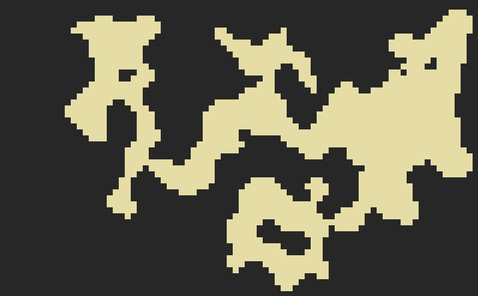

# Procedural Content Generation with Machine Learning Optimized WFC Algorithm

## Overview

This repository showcases an implementation of procedural content generation using the Wave Function Collapse (WFC) algorithm, enhanced and optimized with machine learning techniques. Tthis project leverages machine learning to fine-tune and optimize the generation process. This README provides an introduction to the project, its features, and instructions for usage.

## Table of Contents

- [Features](#features)
- [Getting Started](#getting-started)
- [Machine Learning Optimization](#machine-learning-optimization)

## Features

- Procedural content generation for various applications such as game levels, textures, and more.
- Integration of machine learning techniques for optimizing the WFC algorithm.

## Getting Started
## Machine Learning Optimization
